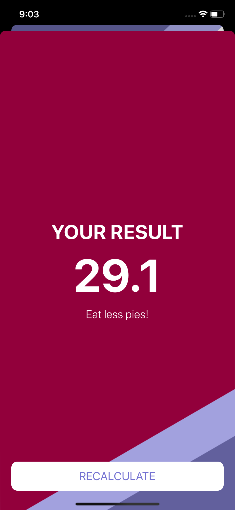

# BMI Calculator

### This will determine the BMI of your body depending on height and weight

### credits: https://www.yazanalmatar.com

## Getting Started

- \$ git clone https://github.com/YazanAlmatar99/BMI-Calculator-
- \$ cd BMI-Calculator-
- \$ open BMI Calculator.xcodeproj

## Requirements

- Swift 5
- IOS 13

